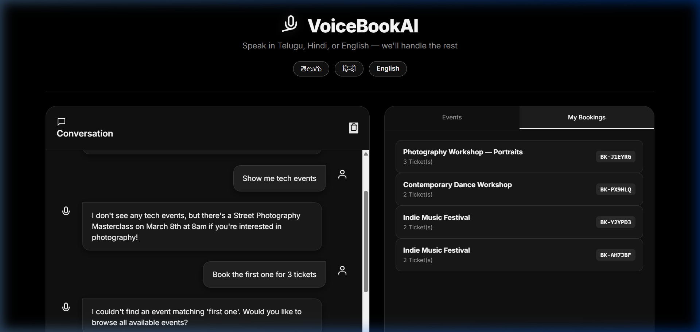
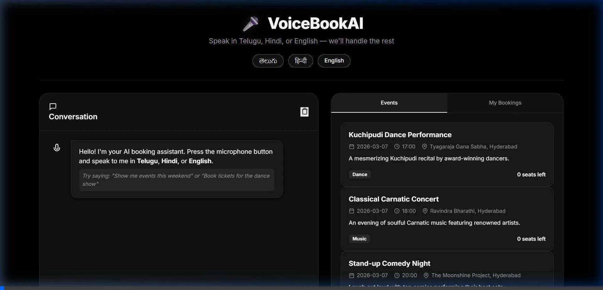

# 🎤 VoiceBookAI — AI Voice Event Booking System

A voice-first AI assistant that lets users browse, book, and get recommendations for events entirely through speech in **Telugu (తెలుగు)**, **Hindi (हिन्दी)**, or **English**.

---

## 🏗️ Task Selection & Rationale
**Selected Task: Task [03] — Conversational Voice AI**

I chose this task because it represents the future of user interfaces — moving beyond screens to natural, multi-turn dialogue. Developing a system that can handle language switching (English/Hindi/Telugu), extract intents from casual speech, and manage conversational state (like "book the first one") presents exciting technical challenges in orchestrating STT, LLMs, and TTS into a low-latency loop.

---

## ✨ Key Features

| Feature | Description |
|---------|-------------|
| 🎙️ **Voice Input** | Speak in Telugu, Hindi, or English — auto-detected language. |
| 🧠 **Smart Intent** | LLM extracts event, date, time, and ticket count from natural speech. |
| 📅 **Event Database** | 15 seeded events across 8 categories with real-time availability. |
| 🎟️ **Instant Booking** | Book with voice, get a reference code immediately. |
| 💡 **No Disappointment** | When an event is full, AI offers 2–3 alternatives instantly. |
| 💬 **Multi-turn Chat** | Handles relative references like "Book it" or "The first one". |
| 🔊 **Voice Response** | Real-time multilingual audio response via gTTS. |


---

## 🛠️ Tech Stack & Architecture

### **Data Flow**
1. **Frontend**: Captures audio (Web Audio API) or text.
2. **STT (Speech-to-Text)**: **OpenAI Whisper (Local)** transcribes audio on-device.
3. **Intent Extraction**: **Gemini 2.0 Flash (via OpenRouter)** parses raw text into structured intents.
4. **Conversation Manager**: Maintains session state, resolves relative indexes, and queries the **SQLite** DB.
5. **TTS (Text-to-Speech)**: **gTTS** synthesizes the assistant's response in the detected language.
6. **Playback**: Frontend receives audio URL and plays it back immediately.

### **Architecture Diagram**
```text
[Browser] <--- API ---> [FastAPI]
    |                      |
(Recorder)           (Whisper STT)
                           |
                     (Gemini LLM)
                           |
                   (Conversation State)
                           |
                      (SQLite DB)
                           |
                       (gTTS)
```

---

## 🚀 Setup Instructions

### **Prerequisites**
- **Python 3.10+**
- **[uv](https://docs.astral.sh/uv/)** (Highly recommended for fast dependency management)
- **FFmpeg** (Required for Whisper audio processing)
- **OpenRouter API Key** (Get it at [openrouter.ai](https://openrouter.ai/))

### **Local Deployment**

1.  **Clone the Repository**:
    ```bash
    git clone https://github.com/your-username/VoiceBookAI.git
    cd VoiceBookAI
    ```

2.  **Environment Setup**:
    Create a `.env` file in the root directory:
    ```bash
    OPENROUTER_API_KEY=your_key_here
    LLM_MODEL=google/gemini-2.0-flash-001
    WHISPER_MODEL_SIZE=base
    ```

3.  **Install Dependencies**:
    ```bash
    uv sync
    ```

4.  **Run the Application**:
    ```bash
    uv run uvicorn backend.main:app --reload --host 0.0.0.0 --port 8000
    ```

5.  **Access the UI**:
    Open `http://localhost:8000` in your browser.

---

## 🎯 Demo & Screenshots

### **Full Conversational Demo**
The following recording shows a multi-turn conversation where a user tries to book a full event and the AI intelligently suggests alternatives.


---

### **Premium Monochromatic UI**
The interface is designed with a premium, glassmorphic aesthetic inspired by Sarvam AI.

| Home / Events View | Mobile-Responsive Check |
|-------------------|-------------------------|
|  |  |

---

### **Edge Case: Event Full Handling**
- **Scenario**: User requests "Classical Carnatic Concert" (marked as Full in DB).
- **AI Action**: Detects zero availability, fetches similar events in the same category or date, and presents them in a natural multi-turn prompt.
- **Reference**: See the "Full Conversational Demo" above for the visual flow of this logic.

---

## ⚠️ Known Limitations & Future Improvements

### **Current Limitations**
1. **Latency**: Local Whisper `base` model takes 1-2 seconds for transcription.
2. **Stateless Audio**: TTS files are stored in `/tmp/`. In a multi-instance production environment, these should be on a CDN/GCS.
3. **Authentication**: Currently uses a simple session ID; no persistent user accounts.

### **Future Improvements**
1. **Voice Activity Detection (VAD)**: Implement Silero VAD to automatically stop recording when the user finishes speaking.
2. **Cloud Whisper**: Move to OpenAI Whisper API for <500ms STT latency.
3. **Vector Search**: Use FAISS or a Vector DB for even better event discovery via semantic search.
4. **Voice Cloning**: Integrate ElevenLabs for more expressive and human-like voices in all three languages.

---

## 📜 License
MIT License - 2026 VoiceBookAI Team.
